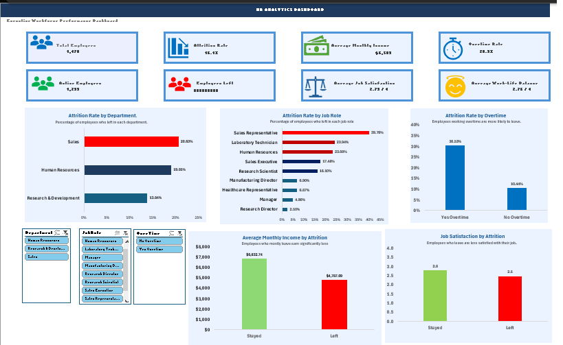

# HR Analytics Dashboard

End-to-end HR analytics project using Python and Excel to analyze employee attrition, workforce characteristics, and potential retention drivers.

## Project Overview

This project analyzes employee attrition across a 1,470-employee workforce.

The objective was to transform employee-level HR data into a validated analytical dataset, calculate business KPIs, identify attrition patterns, and build an interactive Excel dashboard for decision-making.

## Business Questions

- What is the overall employee attrition rate?
- Which departments have the highest attrition?
- Which job roles have the highest attrition?
- Is overtime associated with higher attrition?
- How does monthly income differ between employees who leave and those who stay?
- Does job satisfaction differ between employees who leave and those who stay?

## Key Findings

- Overall attrition rate: 16.12%
- Sales has the highest department attrition at approximately 20.63%.
- Employees working overtime have substantially higher attrition than employees who do not.
- Employees who left have lower average monthly income than employees who stayed.
- Employees who left also show lower average job satisfaction.

## Project Workflow

Raw HR Data
↓
Data Quality Inspection
↓
Data Cleaning with Python
↓
Final Data Validation
↓
KPI & Relationship Analysis
↓
Dashboard Data Preparation
↓
Interactive Excel Dashboard
↓
Business Insights

## Tools Used

- Python
- pandas
- Excel
- PivotTables
- PivotCharts
- Excel Slicers
- Git
- GitHub
- AI-assisted analysis and workflow support

## Repository Structure

| Folder | Purpose |
|---|---|
| `02 Cleaned Data` | Validated cleaned HR dataset |
| `03 Python` | Python scripts for inspection, cleaning, validation and analysis |
| `04 Dashboard Data` | Data prepared for dashboard development |
| `06 Excel Dashboard` | Final interactive Excel dashboard |

## Dashboard

The dashboard contains:

- KPI cards
- Attrition analysis by department
- Attrition analysis by job role
- Attrition analysis by overtime
- Monthly income comparison
- Job satisfaction comparison
- Interactive department filtering

## Skills Demonstrated

- Data quality inspection
- Data cleaning
- Python/pandas
- KPI development
- Exploratory data analysis
- Relationship analysis
- Excel PivotTables
- Excel PivotCharts
- Interactive dashboard development
- Business storytelling
- Git/GitHub

## How to Use

1. Open the `06 Excel Dashboard` folder.
2. Download the final Excel workbook.
3. Open the workbook in Microsoft Excel.
4. Use the available slicers to explore the dashboard.
5. Review the charts and KPI cards to understand workforce attrition patterns.

## Project Outcome

The project demonstrates an end-to-end BI workflow:

**Data → Validation → Analysis → Visualization → Business Insight**

